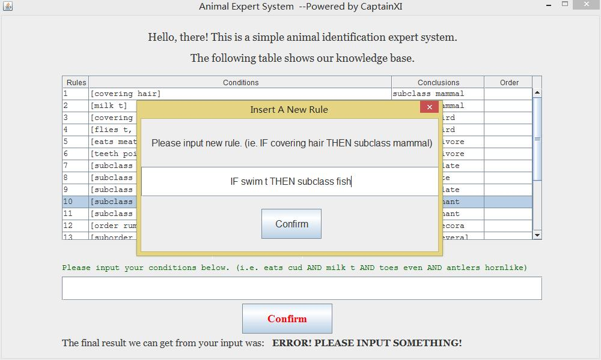

# ProductionSystem

## Introduction 
This project use some basic knowledge of production system which is a fraction of AI. 

## Prerequisite

- Programming language: Java SE 1.7 
- Developing tools: MyEclipse 2014 (Eclipse Kepler) or maybe higher

## How to use 

- Clone this repository using Git Bash (or other equivalent softwares). 
`git clone https://git.oschina.net/candydog/ProductionSystem.git`

- Install Windows Builder (also called Swing) in Eclipse. 
`Help --> Install from site...(MyEclipse) / Install software...(Eclipse)` 
(More specific information please see official site of [Windows Builder](http://www.eclipse.org/windowbuilder/))

- Import project into Eclipse, then build and run. If you build with no error, then you will see the main interface.

- Have fun playing with this simple program and contribute!

## Program screenshots

1. Initial user interface

2. If user inputs nothing, we output nothing.

3. If user inputs valid conditions, we output correspondent conclusion.

4. If user inputs invalid conditions, we output NOTHING.

5. We can add some new rules.

6. We can also delete unwanted rules.

